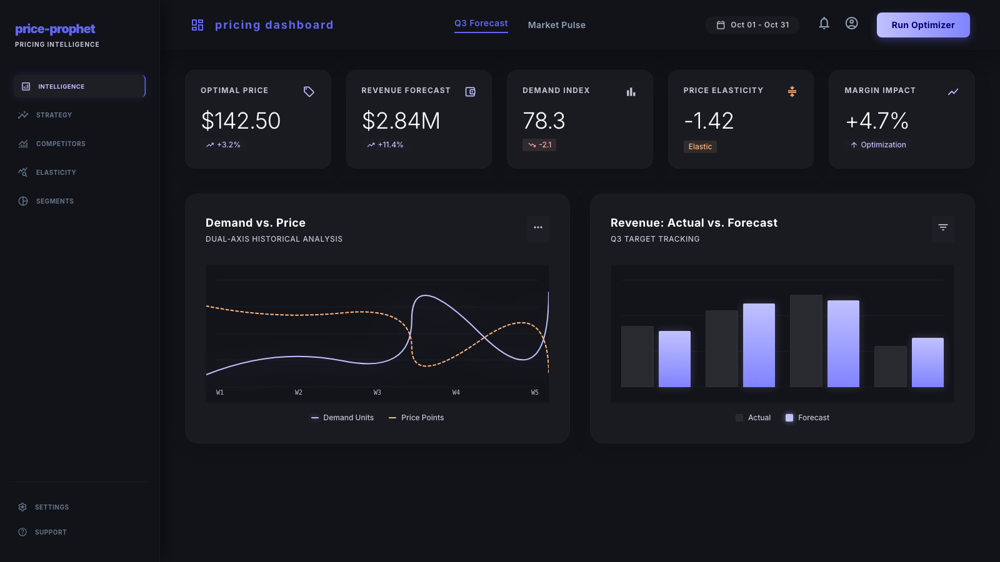
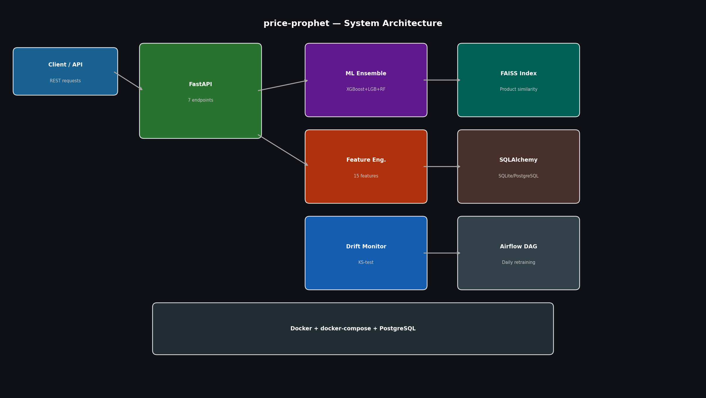

# price-prophet

> E-commerce price optimization and demand forecasting engine with ML ensemble, FAISS-powered product similarity, drift monitoring, and automated Airflow retraining.

[](https://github.com/atharvadevne123/price-prophet/actions/workflows/ci.yml)

## Dashboard UI



A fully interactive pricing intelligence dashboard — built with Google Stitch (Gemini 3.1 Pro) and Tailwind CSS.

**Features:** Optimal price KPI · Revenue forecast · Demand index · Price elasticity · Competitor benchmark · Scenario analysis · Pricing recommendations table

```bash
# Open the dashboard locally
open index.html

# Or serve it
python3 -m http.server 8080
```

> `index.html` — Stitch-generated UI &nbsp;|&nbsp; `index-chartjs.html` — Chart.js version

---

## Architecture



## What It Does

**price-prophet** ingests product pricing data and predicts:
- **Demand forecast** — how many units will sell at a given price
- **Optimal price** — the price point that maximizes profit (not just revenue)
- **Similar products** — FAISS vector similarity search over a product index
- **Drift detection** — KS-test per feature to detect distribution shift in incoming data

The ML core uses a **VotingRegressor ensemble** (XGBoost + LightGBM + RandomForest) wrapped in a sklearn Pipeline with StandardScaler, trained with **5-fold cross-validation** and RMSE tracking.

## API Endpoints

| Method | Endpoint | Description |
|--------|----------|-------------|
| `GET`  | `/health` | Health check |
| `POST` | `/forecast` | Predict demand + optimal price |
| `POST` | `/train` | Trigger model retraining |
| `GET`  | `/drift` | KS-test drift analysis |
| `POST` | `/similar` | FAISS-based similar products |
| `GET`  | `/metrics` | Model metrics + prediction health |
| `GET`  | `/predictions` | Recent prediction history |

## Quick Start

### Local (SQLite)

```bash
git clone https://github.com/atharvadevne123/price-prophet
cd price-prophet
pip install -r requirements.txt
cp .env.example .env
uvicorn app.main:app --reload --port 8000
```

Visit `http://localhost:8000/docs` for the interactive API docs.

### Docker (PostgreSQL)

```bash
cp .env.example .env
docker-compose up --build
```

## Example Usage

```bash
# Forecast demand and optimal price
curl -X POST http://localhost:8000/forecast \
  -H "Content-Type: application/json" \
  -d '{
    "product_id": "LAPTOP-001",
    "base_price": 999.99,
    "competitor_price": 1049.99,
    "category": "electronics",
    "stock_level": 150,
    "historical_demand_7d": 45,
    "historical_demand_30d": 180
  }'

# Find similar products
curl -X POST http://localhost:8000/similar \
  -H "Content-Type: application/json" \
  -d '{"base_price": 999.99, "category": "electronics", "k": 5}'

# Check for data drift
curl http://localhost:8000/drift
```

## Feature Engineering

The model uses **15 engineered features**:

| Feature | Description |
|---------|-------------|
| `base_price` | Product's current price |
| `competitor_price` | Competitor's price |
| `price_ratio` | base / competitor price |
| `day_of_week` | 0=Mon ... 6=Sun |
| `month` | Calendar month (1–12) |
| `is_weekend` | Binary flag |
| `is_holiday_season` | Nov, Dec, Jan flag |
| `category_encoded` | Integer encoding of category |
| `stock_level` | Current inventory |
| `days_since_last_promotion` | Recency of last promo |
| `historical_demand_7d` | 7-day trailing demand |
| `historical_demand_30d` | 30-day trailing demand |
| `demand_trend` | Short vs long-term ratio |
| `price_elasticity_estimate` | Estimated elasticity |
| `margin_ratio` | (price - cost) / price |

## ML Architecture

```
Input Features (15)
       │
       ▼
StandardScaler
       │
       ▼
VotingRegressor
  ├── XGBoostRegressor  (n_estimators=100, max_depth=4)
  ├── LGBMRegressor     (n_estimators=100, max_depth=4)
  └── RandomForestRegressor (n_estimators=100, max_depth=8)
       │
       ▼
5-Fold Cross-Validation → RMSE tracking
       │
       ▼
Price Optimizer (grid search over 20 price points)
```

## Monitoring & Drift Detection

- **KS-test** applied per feature between reference distribution and recent predictions
- Drift detected when `p_value < 0.05`
- `drift_rate` = fraction of features showing drift
- Airflow DAG triggers retraining when `drift_rate > 0.30`
- All drift events logged to PostgreSQL

## Testing

```bash
pip install pytest httpx
pytest tests/ -v
```

Test coverage:
- `test_api.py` — 10 API endpoint tests
- `test_features.py` — 9 feature engineering tests
- `test_model.py` — 7 model training/prediction tests
- `test_monitoring.py` — 7 drift detection tests

## Automated Retraining (Airflow)

The `dags/retrain_dag.py` DAG runs daily at 02:00 UTC:

1. **Health check** → verify API is up
2. **Drift check** → call `/drift` endpoint
3. **Conditional retrain** → only if `drift_rate > 0.30`
4. **Log metrics** → record run metadata

## Environment Variables

See `.env.example` for all configuration options.

Key variables:
- `DATABASE_URL` — SQLite (dev) or PostgreSQL (prod)
- `MODEL_PATH` — path to saved model joblib
- `DRIFT_RATE_RETRAIN_THRESHOLD` — drift rate to trigger retraining (default: 0.30)

## Tech Stack

- **Python 3.11** + FastAPI + uvicorn
- **ML**: XGBoost, LightGBM, RandomForest (sklearn VotingRegressor)
- **Feature store**: sklearn Pipeline + StandardScaler
- **Similarity search**: FAISS (cosine similarity fallback)
- **Monitoring**: scipy KS-test, SQLAlchemy drift logs
- **Database**: SQLAlchemy + SQLite (dev) / PostgreSQL (prod)
- **Orchestration**: Apache Airflow DAG
- **Infra**: Docker + docker-compose
- **CI**: GitHub Actions (ruff lint + pytest)
